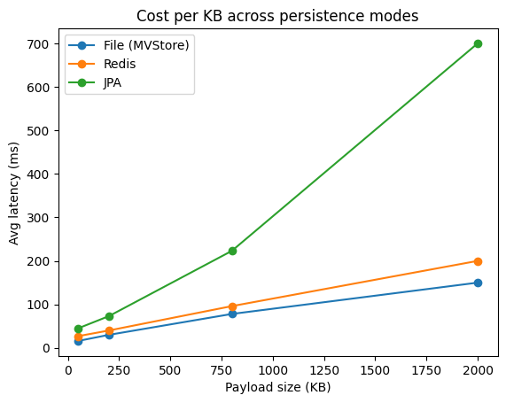
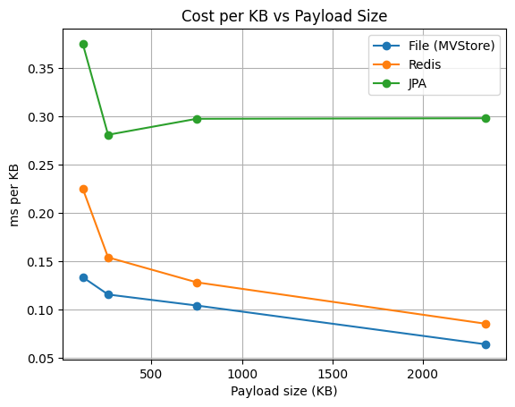

# Flow Bench 🚀

This repository contains a performance benchmarking setup for evaluating **Quarkus Flow** under different persistence strategies and workflow complexities.

It is designed to measure how workflow execution behaves under load and how different persistence backends impact performance, latency, and scalability.

---

## 🎯 Purpose

This project benchmarks workflows using [k6](https://k6.io/) to analyze:

* 📈 Throughput (requests/sec)
* ⏱ Latency (avg, p90, p95)
* ⚠️ Dropped iterations (system saturation)
* 💾 Persistence overhead
* 🔁 Recovery capabilities

It helps answer:

* How much does persistence cost?
* What is the impact of workflow complexity?
* How does the system behave under high load?
* Which persistence backend provides the best trade-off?


---

## 🧪 Benchmark philosophy

This project benchmarks **Quarkus Flow** using **purpose-built micro-workflows**, not real business workflows.

Each workflow isolates a **single stress dimension** of the engine:

* execution overhead
* payload growth
* CPU-heavy workflow
* step-count workflow

The goal is to establish **practical thresholds and limits of Quarkus Flow itself**, independent of business logic.

---

## ⚙️ Workflows

The repository includes **4 workflows**, each representing a different execution pattern.

---

### 1. Execution Overhead `HelloWorkflow`

**Description:**

* Minimal workflow with a single step

```json
{ "message": "hello world!" }
```

**Purpose:**

* Baseline performance
* Measures framework overhead without complexity

**Characteristics:**

* ⚡ Extremely fast
* 🧪 Ideal for sanity checks and baseline comparisons

---


## 2️⃣ Memory / payload workflow (JSON-growing payload)

### Purpose

* state size growth
* serialization/deserialization cost
* persistence overhead (Redis / JPA / file)

### Shape

* fixed number of steps (5)
* one dominant amplification step
* payload controlled by:

  * `items` → width
  * `iterations` → depth

---

## 🔥 Important behavior

This workflow follows an **amplification pattern**:

```
small → medium → medium → LARGE → small
```

* Only one step (`set-3`) produces the large payload
* All other steps remain smaller

---

## 📊 Key metrics

### 🔹 Peak step payload

Largest state snapshot persisted at a single step.

Example:

* `100k mutations` → ~**780 KB peak payload**

---

### 🔹 Total persisted payload per workflow

Sum of all persisted states across steps.

Example:

* `100k mutations` → ~**830 KB total persisted**

---

## 📐 Payload sizing (empirical)

From measurements:

```
~7.8 bytes per mutation
```

### Examples

| Mutations | Peak payload |
| --------: | -----------: |
|       10k |       ~78 KB |
|       30k |      ~235 KB |
|      100k |      ~780 KB |
|      300k |     ~2.35 MB |
|        1M |      ~7.8 MB |
|        3M |     ~23.5 MB |

---

## ⚡ Performance characteristics (Redis example)

### Latency vs payload size

| Payload | Avg latency |
| ------: | ----------: |
|  ~80 KB |      ~10 ms |
| ~235 KB |      ~18 ms |
| ~780 KB |      ~67 ms |
| ~2.3 MB |     ~103 ms |
| ~7.8 MB |     ~283 ms |
|  ~23 MB |     ~780 ms |

👉 Latency grows **approximately linearly with payload size**

---

## 🎯 Key insight

> Performance is dominated by the **largest state snapshot**, not the number of steps.

---

## 🚀 Threshold model

System limits are defined by:

```
growing-payload = rate × payload size × latency
```

### Observed behavior

* High rate + small payload → very stable
* Low rate + large payload → still stable
* High rate + large payload → memory pressure

---

## 🧪 Example benchmark commands

### Throughput-oriented

```bash
k6 run -e RATE=150 -e ITEMS=1000 -e ITERATIONS=10 bench/k6-json.js
k6 run -e RATE=150 -e ITEMS=1000 -e ITERATIONS=100 bench/k6-json.js
```

### Payload-oriented

```bash
k6 run -e RATE=5 -e ITEMS=1000 -e ITERATIONS=600 bench/k6-json.js
k6 run -e RATE=1 -e ITEMS=10000 -e ITERATIONS=300 bench/k6-json.js
```


---

### 3. `OrderEnrichmentWorkflow`

**Description:**

* Workflow with an **external HTTP call**

Steps:

1. Receive order
2. Call enrichment service (`/mock/enrich`)
3. Merge response into workflow state
4. Complete workflow

**Purpose:**

* Measure impact of I/O-bound steps
* Simulate real-world service orchestration

**Characteristics:**

* 🌐 Network latency involved
* 🔄 Data transformation
* ⚖️ Mix of compute + I/O

---

### 4. Persistence Stress Workflow (Step Count)

## Purpose

This workflow family isolates **persistence overhead per step** by:

* keeping payload size **small and constant**
* increasing the number of sequential steps
* forcing **frequent persistence checkpoints**

This allows measuring:

* step transition cost
* persistence write amplification (per step)
* throughput degradation under high checkpoint frequency

Unlike the JSON workflow (payload stress), this focuses on **cost per step**, not cost per byte.

---

## Workflow Shape

* 20 / 50 / 100 sequential steps
* each step performs a small `set(...)` transformation
* payload remains constant (no amplification)
* each step is persisted independently

Endpoints:

* `/bench/order20`
* `/bench/order50`
* `/bench/order100`

---

## 🧪 Benchmark Setup

Benchmarks are executed using **k6** with a constant arrival rate:

```bash
k6 run -e RATE=5000 -e DURATION=2m bench/k6-order20.js
```

Parameters:

* `RATE` → target requests per second
* `DURATION` → test duration

---

## 💾 Persistence Modes

The project supports **4 persistence modes**, selectable via Maven profiles.

---

### 1. No Persistence (default)

```bash
mvn clean package
```

**Description:**

* No state is stored
* Everything runs in memory

**Characteristics:**

* ⚡ Lowest latency
* 🚀 Highest throughput
* ❌ No recovery if JVM crashes

---

### 2. Redis

```bash
mvn clean package -Predis -Dquarkus.profile=redis
```

**Description:**

* State stored in Redis
* Each workflow step persisted as a key (`:do/*`)

**Characteristics:**

* ⚡ Very low latency
* 📈 High throughput
* 💾 Durable (in-memory)
* 🔁 Supports recovery

**Important behavior:**

* Each step is persisted individually
* Workflow root key may be deleted after completion
* Step keys remain (no TTL by default)

---

### 3. File (MVStore)

```bash
mvn clean package -Pfile -Dquarkus.profile=file
```

**Description:**

* State stored on disk using MVStore

**Characteristics:**

* ⚖️ Moderate latency
* 💾 Durable
* 🔁 Supports recovery

---

### 4. JPA (PostgreSQL)

```bash
mvn clean package -Pjpa -Dquarkus.profile=jpa
```

**Description:**

* State persisted in a relational database

**Characteristics:**

* 🐢 Highest latency
* 📉 Lower throughput
* 💾 Strong durability
* 🔁 Full recovery support

---

## 🧠 Key Concepts

### Tail Latency

Tail latency (p90, p95) represents the slowest requests.

* Important for user experience
* Often increases significantly under load
* Strongly affected by persistence and I/O

---

### Dropped Iterations

k6 metric:

```text
dropped_iterations
```

Means:

> Requests that were scheduled but never executed because the system was saturated.

---
## 💾 Local persistence services

This project can run with:

- **Redis** on `localhost:6379`
- **PostgreSQL (JPA)** on `localhost:5432`, database `flow`, user `flow`, password `flow`
- **MVStore file persistence** at `/tmp/hello-flow.mvstore.db`

### Start Redis and PostgreSQL

Start both containers in the background:

```bash
docker compose up -d
```

Start only Redis:
```bash
docker compose up -d redis
```

Start only PostgreSQL:
```bash
docker compose up -d postgres
```

### Stop containers

Stop and remove containers, but keep persisted data:
```bash
docker compose down
```

### Reset to a fresh instance

Stop and remove containers and delete their volumes:
```bash
docker compose down -v
```

This gives you a brand-new Redis and PostgreSQL state the next time you start them.


### MVStore reset

MVStore is file-based, not container-based. To start with a fresh MVStore database:

```bash
rm -f /tmp/hello-flow.mvstore.db
```

---

## 🚀 Build and Run the app with each profile

No persistence:
```bash
mvn clean package
java -jar target/quarkus-app/quarkus-run.jar
```

File (MVStore):
```bash
rm -f /tmp/hello-flow.mvstore.db
mvn clean package -Pfile -Dquarkus.profile=file
java -jar -Dquarkus.profile=file target/quarkus-app/quarkus-run.jar
```

Redis:
```bash
docker compose up -d redis
mvn clean package -Predis -Dquarkus.profile=redis
java -jar -Dquarkus.profile=redis target/quarkus-app/quarkus-run.jar
```

JPA:
```bash
docker compose up -d postgres
mvn clean package -Pjpa -Dquarkus.profile=jpa
java -jar -Dquarkus.profile=jpa target/quarkus-app/quarkus-run.jar
```

### Run benchmarks

```bash
k6 run -e RATE=5000 -e DURATION=2m bench/k6-order20.js
```

### Previous evaluation

You can check with cURL command that your workflow is ready to run benchmarks

```bash
curl -X GET http://localhost:8080/hello-flow  -H 'content-type: application/json'
curl -X POST http://localhost:8080/bench/order   -H 'Content-Type: application/json'   -d '{"orderId":"1","amount":42.5,"customerId":"cust-1"}'
curl -X POST http://localhost:8080/bench/order20   -H 'Content-Type: application/json'   -d '{"orderId":"1","amount":42.5,"customerId":"cust-1"}'
```


---

## 📊 What to Compare

When analyzing results, focus on:

* Throughput (`http_reqs`)
* Latency (`avg`, `p90`, `p95`)
* Dropped iterations
* Resource usage

Compare across:

* Different workflows
* Different persistence modes

---

## 💡 Deeper Insights: Cost per KB vs Cost per Step

This benchmark isolates two orthogonal scaling dimensions:

* **Payload size (JSON workflow)** → memory / serialization / persistence volume
* **Step count (order workflow)** → persistence frequency / overhead

These behave very differently under load.

---

## 1. Cost per Step (Persistence Frequency)

> Each additional step introduces a **fixed overhead**: persistence + transition + scheduling.

This overhead is:

* relatively small at low load
* becomes dominant under high concurrency

> Cost-per-step is low in isolation, but scales poorly with concurrency due to contention on persistence and execution resources.


---

## 2. Cost per KB (Payload Size)

* latency increases with payload size
* cost appears roughly proportional to payload size

> The dominant factor is **the largest persisted snapshot**, which carries the large payload

### Cost per KB across persistence modes




**File (MVStore)** shows the best scaling behavior:
* Near-linear growth
* Decreasing cost per KB as payload increases

**Redis** behaves similarly but with higher baseline cost:
* Moderate network and serialization overhead
* Still benefits from batching effects

**JPA** shows significantly worse scaling:
* Higher baseline latency
* Cost per KB remains consistently high (~0.3 ms/KB)
* Limited benefit from payload amortization

---

## 3. Cost Model Comparison

| Dimension     | Behavior                     | Bottleneck Type        |
| ------------- | ---------------------------- | ---------------------- |
| Cost per step | fixed overhead per step      | persistence frequency  |
| Cost per KB   | proportional to payload size | serialization + db I/O |

---

### Combined effect

Worst-case scenario:

* large payload
* many steps
* high request rate

➡️ leads to:

* persistence saturation
* memory pressure
* latency spikes
* throughput collapse


---

## 📌 Conclusion

* Workflow complexity directly impacts persistence cost
* Redis provides the best balance between speed and persistence (needs to be refined still)
* External calls (enrichment workflow) introduce latency variability
* Persistence strategy must match system requirements
* two factors dominate scalability:

  * **state size**
  * **number of steps**

> The system scales well when **one dimension is controlled**,
> but combining **large payloads + many steps + high rate** quickly reaches system limits.

---
